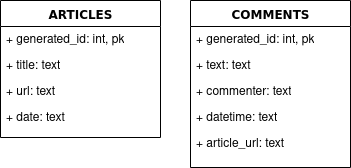

# korean-hate-comments
**지금 바로 사용해 보세요! [(링크)](http://akpl.xyz)**


[Korean Hate Speech Dataset](https://github.com/kocohub/korean-hate-speech)을 이용해 구현한 악플 예측 모델 및 인터넷 커뮤니티의 악플 내려받기 서비스

## 디렉토리 구조 및 주요 파일 설명
```
+-- good_comments_guardian_ipynb: 모델 구현 과정을 담은 Jupyter Notebook
+-- backend
|	+-- crawlers: 일베, 인벤 등에서 댓글 수집
|	+-- model: 예측 모델 생성
|	+-- build_db.py: crawlers 를 이용해 DB 구축
|	+-- comments.db: build_db.py로 구축된 DB
|	+-- main.py
+-- frontend: Ionic + React로 구현된 프론트엔드
```

## 사진
### 댓글 DB 구축 과정
#### build_db.py 구동


#### 생성된 DB
+ 총 게시물 수: 22,582건 (일베:12,304건, 인벤: 10,278건)
        -일베: 2020-08-28~2020-09-15 사이의 일간 베스트 게시글
        -인벤: 2020-06-07~2020-09-15 사이의 오픈 이슈 갤러리 3추글

+ 총 댓글 수: 494,331건 (일베:325,890건, 인벤: 198,636건)


